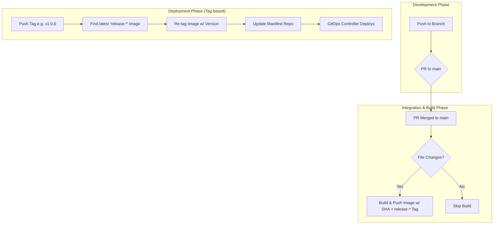

# 🚀 CI/CD 가이드

이 문서는 `vllm-frontend-public` 프로젝트의 CI/CD 파이프라인에 대한 가이드와 그 전략을 설명합니다. 워크플로는 크게 **빌드**와 **배포** 두 가지로 나뉩니다.

## 📋 목차

- [워크플로우 개요 및 핵심 전략](#워크플로우-개요-및-핵심-전략)
- [각 워크플로우 상세](#각-워크플로우-상세)
- [개발 워크플로우](#개발-워크플로우)
- [배포 프로세스](#배포-프로세스)
- [문제 해결](#문제-해결)

## 🔄 워크플로우 개요 및 핵심 전략

### 핵심 전략
우리 프로젝트의 CI/CD 전략은 **효율성**, **안정성**, **자동화**라는 세 가지 핵심 원칙을 기반으로 합니다.

- **효율성 (파일 경로 기반 빌드)**: `dorny/paths-filter` 액션을 사용하여 프론트엔드 관련 파일(`src/**`, `Dockerfile` 등)이 변경되었을 때만 빌드 작업을 트리거합니다. 이를 통해 불필요한 이미지 빌드를 방지합니다.

- **안정성 (GitOps 기반 배포)**: 배포는 **수동 태그 기반**으로 트리거되며, **GitOps** 원칙을 따릅니다. `main` 브랜치의 모든 변경이 자동으로 프로덕션에 배포되지 않으며, 명시적인 버전 릴리스를 통해 안정성을 확보합니다.

### 전체 워크플로 흐름도



### 워크플로 요약
| 워크플로우 | 파일명 | 트리거 | 목적 |
|------------|--------|--------|------|
| **Build** | `frontend-build.yml` | `main` 브랜치 머지 (파일 변경 시) | Docker 이미지 빌드 및 GHCR Push (SHA + `release-*` 태그) |
| **Deploy** | `frontend-deploy.yml` | 버전 태그 (`v*.*.*`) 생성 | GitOps 매니페스트 업데이트 (이미지 버전 태그) |

## 📝 각 워크플로우 상세

### 1. 프론트엔드 빌드 (Build) - `frontend-build.yml`

- **목적**: 프론트엔드 애플리케이션을 컨테이너화하고, 릴리스 가능한 아티팩트(Docker 이미지)를 생성합니다.
- **트리거**:
    - `main` 브랜치로 `push`
    - `main` 브랜치에 대한 `pull_request`
- **주요 작업**:
    1.  **파일 변경 감지**: `dorny/paths-filter`를 사용해 프론트엔드 소스 코드, Dockerfile 등 관련 파일 변경 시에만 워크플로를 실행합니다.
    2.  **이미지 빌드 및 푸시**:
        - **Pull Request**: 이미지를 빌드만 수행하여 병합 전 코드의 빌드 가능성을 검증합니다. (푸시하지 않음)
        - **Push to `main`**: 이미지를 빌드하고, 두 개의 태그(`Commit SHA`, `release-타임스탬프`)를 사용하여 `ghcr.io`에 푸시합니다. `release-*` 태그가 붙은 이미지가 '릴리스 후보'가 됩니다.

### 2. GitOps 기반 배포 (Deploy) - `frontend-deploy.yml`
배포는 명시적인 버전 릴리스를 통해 안정성을 확보합니다.

- **트리거**:
    - 버전 태그 `push` (예: `v1.0.0`, `v1.2.3`)
- **주요 작업 (GitOps)**:
    1.  **이미지 리태깅(Re-tagging)**: 새 이미지를 빌드하지 않습니다. 대신 `ghcr.io` 레지스트리에서 `release-*` 형식의 태그가 붙은 가장 최신 이미지를 검색하여, 배포를 트리거한 버전 태그(예: `v1.2.3`)를 추가로 부여합니다. (`crane` 도구 사용)
    2.  **매니페스트 업데이트**:
        - 별도의 매니페스트 저장소(`ThakiCloud/vllm-manifests-public`)를 체크아웃합니다.
        - `vllm-frontend/frontend-deployment.yaml` 매니페스트 파일 내의 이미지 태그를 새로 부여된 버전 태그로 업데이트합니다.
        - 변경 사항을 매니페스트 저장소에 커밋하고 푸시합니다.
    3.  **클러스터 배포**: ArgoCD나 Flux와 같은 GitOps 도구가 매니페스트 저장소의 변경을 감지하여 쿠버네티스 클러스터에 자동으로 애플리케이션을 업데이트합니다.

## 👩‍💻 개발 워크플로우

### 🆕 새 기능 개발

```bash
# 1. 새 브랜치 생성
git checkout -b feature/add-login-button

# 2. 작업 수행 (예: React 컴포넌트 수정)
# - src/components/LoginButton.jsx

# 3. 커밋 및 푸시
git add .
git commit -m "feat: Add new login button"
git push origin feature/add-login-button
```

### 📋 Pull Request 생성

- GitHub에서 `main` 브랜치로 PR을 생성합니다.
- PR 생성 시 `frontend-build.yml` 워크플로우가 자동으로 실행되어 Docker 빌드 유효성을 검증합니다.

### ✅ 승인 및 머지

1. **리뷰어 승인 후 PR을 머지합니다.**
2. **`main` 브랜치 머지** → `frontend-build.yml` 워크플로우가 다시 실행되어, 이미지를 빌드하고 Commit SHA와 `release-*` 태그를 붙여 `ghcr.io`에 푸시합니다.

## 🚀 배포 프로세스

### 📦 프론트엔드 배포

```bash
# 1. main 브랜치 최신화
git checkout main
git pull origin main

# 2. 배포할 버전을 위한 태그 생성 및 푸시
# 형식: v{Major}.{Minor}.{Patch}
git tag v1.2.3
git push origin v1.2.3
```

**→ 자동으로 `frontend-deploy.yml` 워크플로우가 실행됩니다.**
**→ 배포 결과는 `vllm-manifests-public` 리포지토리에서 확인할 수 있습니다.**

## 🛠️ 문제 해결

### 🚨 빌드 실패 대응

- `frontend-build.yml` 워크플로우 로그에서 Docker 빌드 실패 원인을 확인합니다. 로컬에서 동일한 Dockerfile로 빌드를 테스트해볼 수 있습니다.

### 🚀 배포 실패 대응

- **"Image not found" 또는 배포 실패**:
  1. `main` 브랜치에 대한 `frontend-build.yml` 워크플로우가 성공적으로 실행되어 `ghcr.io`에 `release-*` 태그가 포함된 이미지를 푸시했는지 확인합니다.
  2. `crane ls` 또는 GHCR UI를 통해 레지스트리에 `release-*` 이미지가 존재하는지 확인합니다.
- **Manifest 업데이트 실패**:
  1. `frontend-deploy.yml` 워크플로우의 권한(`secrets.MANIFESTS_SECRET`)이 올바른지 확인합니다.
  2. `ThakiCloud/vllm-manifests-public` 리포지토리의 파일 경로(`vllm-frontend/frontend-deployment.yaml`)가 올바른지 확인합니다.

---

**📞 문의사항이 있으시면 GitHub Issues를 생성해 주세요!** 